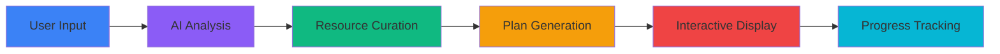

<div align="center">

# 🧠 Neuro AI Study Planner

### *The World's First AI-Powered Study Planning Platform*

[](https://firebase.google.com)
[](https://openai.com)
[](i18n/)

**Transform Your Learning Journey with AI-Driven Personalization**

[🚀 Live Demo](https://bestplannerai.com/?lang=en) • [📖 Documentation](docs/) • [🎨 Brand Kit](press/) • [📸 Screenshots](screenshots/) • [🤝 Contributing](#-contributing)

---

### ⚡️ *Supercharge Your Learning by Up to 40%*
### ✨ *Pick a Subject → Set Goals → Get Personalized Daily Plans*
### 🌍 *Available in 3 Languages: English | Русский | O'zbek*

---

</div>

---

## 🌟 What Makes This Special?

<div align="center">

### **🎯 World's First AI Study Planner**
*Revolutionary technology that creates completely personalized study plans*

### **🧠 Deep AI Analysis**
*Advanced algorithms analyze your learning style, goals, and time constraints*

### **📅 Day-by-Day Planning**
*Structured daily activities with real educational resources*

### **🔥 Instant Results**
*Generate comprehensive study plans in seconds*

</div>

---

## 🚀 Quick Start

### Live Demo
Visit our live production site: **[https://bestplannerai.com/]**

---

## ✨ Core Features

<table>
<tr>
<td width="50%" valign="top">

### 🎯 **Smart Planning**
- AI analyzes your learning goals
- Personalized study schedules
- Adaptive difficulty progression
- Time-optimized daily blocks

### 📚 **Real Resources**
- Curated educational content
- Video tutorials integration
- Interactive exercises
- Assessment tools

### 🌍 **Multilingual**
- English (EN)
- Russian (RU)
- Uzbek (UZ)
- Full UI localization

</td>
<td width="50%" valign="top">

### 📊 **Progress Tracking**
- Visual progress indicators
- Task completion system
- Achievement celebrations
- Export to PDF/Markdown

### 🎨 **Beautiful UI**
- Modern, responsive design
- Smooth animations
- Dark/light mode support
- Mobile-first approach

### 🔒 **Secure & Private**
- Firebase authentication
- Cloud data storage
- Privacy-focused
- GDPR compliant

</td>
</tr>
</table>

---

## 🏗️ Architecture

### Technology Stack

```
Frontend:
  ├── HTML5 / CSS3
  ├── Vanilla JavaScript (ES6+)
  ├── Firebase (Auth, Firestore)
  ├── OpenAI GPT-4 API
  └── AOS Animations

Backend:
  ├── Firebase Authentication
  ├── Cloud Firestore
  ├── Firebase Hosting
  └── Cloud Storage

AI/ML:
  ├── OpenAI GPT-4
  ├── Custom system prompts
  ├── JSON plan generation
  └── Resource curation
```

### Key Components

- **🧠 AI Engine**: GPT-4 powered plan generation
- **📝 Plan Wizard**: 3-step user onboarding
- **📊 Dashboard**: Progress tracking and analytics
- **🎨 UI System**: Component-based design
- **🌍 i18n**: Full internationalization support

For detailed architecture documentation, see [`docs/architecture.md`](docs/architecture.md)

---

## 📁 Project Structure

```
neuro-ai-planner/
├── 📄 index.html              # Landing page
├── 📄 plan.html               # Plan generator wizard
├── 📄 dashboard.html          # User dashboard
├── 📄 profile.html            # User profile
├── 📄 pricing.html            # Subscription plans
│
├── 📂 scripts/                # JavaScript modules
│   ├── firebase-config.js    # Firebase setup
│   ├── auth.js               # Authentication
│   ├── planGenerator.js      # AI plan generation
│   ├── planRenderer.js       # Plan display engine
│   └── ...                   # Additional modules
│
├── 📂 styles/                 # CSS styling
│   ├── main.css              # Global styles
│   ├── plan.css              # Plan-specific styles
│   └── ...                   # Component styles
│
├── 📂 components/             # Reusable components
│   ├── header.html           # Site header
│   ├── footer.html           # Site footer
│   └── auth-modals.html     # Auth UI
│
├── 📂 i18n/                   # Translations
│   ├── en.json               # English
│   ├── ru.json               # Russian
│   └── uz.json               # Uzbek
│
├── 📂 docs/                   # Documentation
│   ├── architecture.md       # System architecture
│   ├── ai-tools.md           # AI integration guide
│   └── ...                   # Additional docs
│
└── 📂 demo/                   # Demo resources
    └── README.txt            # Demo information
```

---

## 🎯 How It Works



### Step-by-Step Process

1. **🎯 User Input**: Subject, goals, timeline, and preferences
2. **🧠 AI Analysis**: Deep learning algorithms analyze requirements
3. **📚 Resource Curation**: Curates real educational materials
4. **📅 Plan Generation**: Creates day-by-day structured plans
5. **📊 Interactive Display**: Visual progress tracking
6. **🎉 Success Tracking**: Achievement celebrations and analytics

---

## 🔥 Key Capabilities

### AI-Powered Intelligence
- **Deep Analysis**: Studies your learning style and goals
- **Adaptive Planning**: Adjusts difficulty and pacing
- **Resource Matching**: Finds best educational content
- **Progress Optimization**: Continuously improves plans

### Educational Excellence
- **Real Resources**: Actual videos, articles, quizzes
- **Progressive Learning**: Build complexity gradually
- **Assessment Tools**: Tests and practice problems
- **Project-Based**: Hands-on learning approach

### User Experience
- **Instant Results**: Generate plans in seconds
- **Beautiful UI**: Modern, intuitive design
- **Mobile-First**: Responsive on all devices
- **Multilingual**: Support for 3 languages

---

## 📊 Performance Metrics

<div align="center">

| Metric | Value | Status |
|:------:|:-----:|:------:|
| **Lighthouse Performance** | 🟢 95+ | Excellent |
| **Lighthouse Accessibility** | 🟢 98+ | WCAG AA |
| **First Contentful Paint** | 🟢 <1.2s | Fast |
| **Largest Contentful Paint** | 🟢 <2.0s | Fast |
| **Time to Interactive** | 🟢 <3.0s | Fast |

</div>

---

## 🤝 Contributing

We welcome contributions! Please read our contributing guidelines.

### How to Contribute

1. Fork the repository
2. Create a feature branch (`git checkout -b feature/amazing-feature`)
3. Commit your changes (`git commit -m 'Add amazing feature'`)
4. Push to the branch (`git push origin feature/amazing-feature`)
5. Open a Pull Request

### Code of Conduct
Please note we have a Code of Conduct, please follow it in all interactions.

---

## 📄 License

This project is licensed under the MIT License - see the [LICENSE](LICENSE) file for details.

---

## 🙏 Acknowledgments

- OpenAI for GPT-4 API
- Firebase for backend services
- All contributors who have helped shape this project

---

## 📞 Support & Contact

- **Documentation**: [docs/](docs/)
- **Issues**: [GitHub Issues](https://github.com/Abduep53/neuro-ai-planner/issues)
- **Email**: neuroleague.ai@gmail.com
- **LinkedIn**: [Join our community](https://www.linkedin.com/company/neuroleague/)

---

<div align="center">

### **⭐ Star this repo if you find it useful! ⭐**

**Built with ❤️ by the Neuro AI Team**

[⬆ Back to Top](#-neuro-ai-study-planner)

</div>